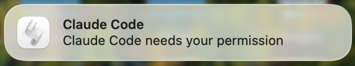

# agent-notify

Get a desktop notification whenever Claude Code asks for your permission — so you know when it needs you, even if you're on a different screen.

Works on **macOS**, **Linux**, and **Windows** (WSL / Git Bash). Works with both the **CLI** and **VS Code extension**.

**Also supports [Slack notifications](#slack-notifications)** — get a Slack message when Claude Code needs your permission or finishes a session, even when you're away from your desk.

## Preview

### macOS



## Install

```bash
curl -fsSL https://raw.githubusercontent.com/acumino/agent-notify/main/install.sh | bash
```

## Uninstall

```bash
curl -fsSL https://raw.githubusercontent.com/acumino/agent-notify/main/install.sh | bash -s -- --uninstall
```

## What it does

Adds a [`PermissionRequest` hook](https://docs.anthropic.com/en/docs/claude-code/hooks) to your Claude Code settings (`~/.claude/settings.json`) that triggers a native desktop notification whenever Claude asks for permission to run a tool.

The installer auto-detects your platform and uses the right notification method:

| Platform | Notification method |
| -------- | ------------------- |
| macOS | `osascript` (native notification center) |
| Linux | `notify-send` (libnotify) |
| WSL | Windows toast via `powershell.exe` |
| Git Bash / MSYS2 | Windows MessageBox via `powershell` |

## Requirements

- **jq** — for JSON manipulation
  - macOS: `brew install jq`
  - Ubuntu/Debian: `sudo apt install jq`
  - Fedora: `sudo dnf install jq`
  - Arch: `sudo pacman -S jq`
  - Windows: `choco install jq` or `scoop install jq`
- **Claude Code** CLI or VS Code extension

### Platform-specific setup

**macOS**: Enable notifications for Script Editor in **System Settings > Notifications > Script Editor > Allow Notifications**. Set alert style to **Alerts** if you want them to stay on screen until dismissed.

**Linux**: Install `libnotify-bin` (Ubuntu/Debian), `libnotify` (Fedora), or `libnotify` (Arch) if `notify-send` is not already available.

## How it works

The install script adds a `PermissionRequest` hook to `~/.claude/settings.json`. For example, on macOS:

```json
{
  "hooks": {
    "PermissionRequest": [
      {
        "matcher": "",
        "hooks": [
          {
            "type": "command",
            "command": "osascript -e 'display notification \"Claude Code needs your permission\" with title \"Claude Code\" sound name \"Ping\"'"
          }
        ]
      }
    ]
  }
}
```

The exact command varies by platform — the installer picks the right one automatically.

## Slack notifications

Get a Slack message when Claude Code needs your permission or finishes a session — useful when you're away from your desk.

### Setup

1. [Create a Slack incoming webhook](https://api.slack.com/messaging/webhooks) for your workspace.

2. Run the installer:

```bash
curl -fsSL https://raw.githubusercontent.com/acumino/agent-notify/main/install-slack.sh | bash -s -- --slack-webhook https://hooks.slack.com/services/...
```

Or interactively (it will prompt for the URL):

```bash
curl -fsSL https://raw.githubusercontent.com/acumino/agent-notify/main/install-slack.sh | bash
```

### Uninstall Slack notifications

```bash
curl -fsSL https://raw.githubusercontent.com/acumino/agent-notify/main/install-slack.sh | bash -s -- --uninstall
```

### Events

Adds `PermissionRequest` and `Stop` hooks to `~/.claude/settings.json`. On each event, the hook calls `~/.claude/remote-notify/notify-slack.sh`, which POSTs a message to your Slack webhook:

| Event | Slack message |
| ----- | ------------- |
| `PermissionRequest` | :bell: Claude Code needs your permission \| Tool: `Bash` |
| `Stop` | :white_check_mark: Claude Code session ended |

The webhook URL is stored in `~/.claude/remote-notify/config` (mode `600`).

**Requires:** `jq` and `curl`

## License

MIT
